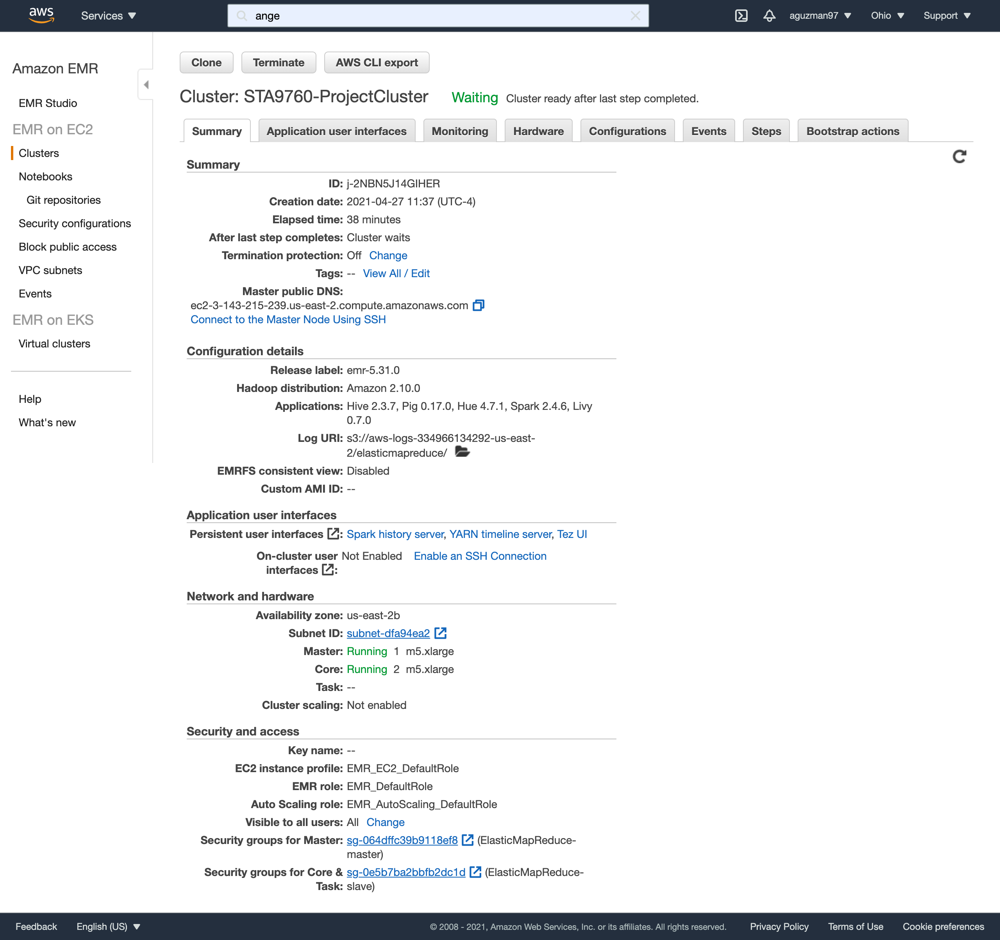
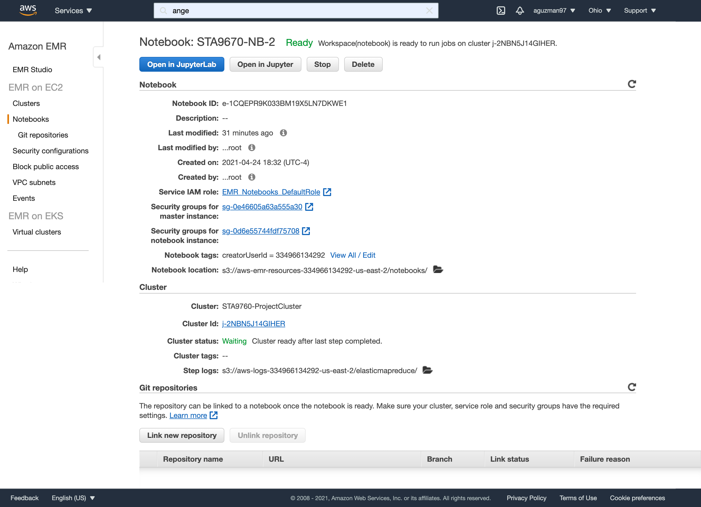

## Project 02: Analyzing 10Gb of Yelp Reviews Data

In the following project, we demostrate the use AWS EMR clusters in order to provide analysis on a large dataset. In this case, we used about 10 GB Yelp data and used python packages to provide analysis. We uploaded the data to AWS S3 buckets where we tapped into throughout our analysis in Jupyter Notebook. The following packages used were: seaborn, pandas, matplot. The following are screenshots for the configuration used in the following project for the cluster and notebook:

****

****

